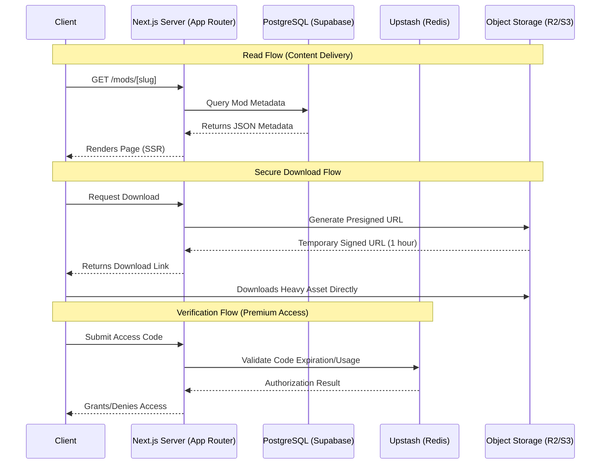

# DungDiBinhLuan - EA FC 26 Modification Hub

DungDiBinhLuan is a high-performance web platform designed to distribute game modifications (faces, kits, gameplay tuning) for EA FC 26. Built with modern web technologies, the application prioritizes speed, SEO, and secure distribution of large file assets.

## System Architecture

The project leverages a modern Jamstack approach with Server-Side Rendering (SSR) and Static Site Generation (SSG) provided by Next.js, backed by a scalable Supabase PostgreSQL database and S3-compatible cloud storage for heavy assets.

### Core Technologies
- **Framework:** Next.js 16 (React 19, App Router)
- **Language:** TypeScript
- **Styling:** Tailwind CSS v4
- **Database & Auth:** Supabase (PostgreSQL) with Row Level Security (RLS)
- **Asset Storage:** Cloudflare R2 / AWS S3
- **Caching & Rate Limiting:** Upstash Redis (Serverless KV)
- **Analytics:** Vercel Analytics

### Data Flow & Component Interaction

The platform employs a hybrid data-fetching strategy, combining static configuration data with dynamic database entries to optimize TTFB (Time to First Byte) and database load.



## Key Implementations & Design Decisions

### 1. Hybrid Content Resolution (`app/mods/[slug]/page.tsx`)
The platform supports two types of mod content: static (hardcoded in TypeScript data files for zero-latency retrieval) and dynamic (fetched from Supabase). The routing system seamlessly resolves between both data stores, prioritizing static definitions before querying the database.

### 2. Secure File Distribution (`app/api/download/route.ts` & `utils/r2.ts`)
To prevent direct hotlinking and bandwidth abuse of multimegabyte/gigabyte game modifications, all download requests are routed through a secure API endpoint. This implementation utilizes the AWS SDK to generate presigned URLs with strict TTL (Time to Live) expiration (default: 3600 seconds), offloading the actual bandwidth out of the Node.js process to the S3 bucket.

### 3. Row Level Security (`supabase-schema.sql`)
The PostgreSQL database is secured using Supabase Row Level Security (RLS) policies. Read operations are permitted publicly for published mods, while write operations (insert/update/delete) strictly require authenticated `Service Role` access or appropriate owner permissions.

### 4. Code Verification System (`app/api/gen-code/route.ts`)
A serverless key-value store (Upstash Redis) is implemented to handle access code generation and validation for premium or gated content. The system generates unique randomized keys and verifies state atomic transitions to prevent reuse.

## Local Environment Setup

### Prerequisites
- Node.js 20.x or higher
- Git

### Installation

```bash
# Clone the repository
git clone https://github.com/tranvietdung1808/dungdibinhluan.git
cd dungdibinhluan

# Install dependencies
npm install
```

### Environment Configuration

Create a `.env.local` file in the root directory and configure the following required services:

```env
# S3-Compatible Object Storage (AWS/Cloudflare R2)
R2_ENDPOINT=https://<account_id>.r2.cloudflarestorage.com
ACCESS_KEY_ID=your_access_key
SECRET_ACCESS_KEY=your_secret_key

# Supabase Configuration
NEXT_PUBLIC_SUPABASE_URL=https://<project_ref>.supabase.co
NEXT_PUBLIC_SUPABASE_ANON_KEY=your_anon_key

# Redis/Upstash Configuration
UPSTASH_REDIS_REST_URL=your_redis_url
UPSTASH_REDIS_REST_TOKEN=your_redis_token

# Admin Operations
ADMIN_SECRET=your_secret_passphrase
```

### Running the Application

```bash
# Start the development server
npm run dev
```

The application will be available at `http://localhost:5000`.

## Directory Structure

```text
c:\dungdibinhluan\
├── .env.local             # Environment secrets
├── package.json           # Dependencies and scripts
├── supabase-schema.sql    # PostgreSQL schema definitions and RLS policies
├── lib/ & utils/          # Shared utilities (Supabase clients, AWS S3 SDK, Upstash)
└── app/                   # Next.js App Router root
    ├── layout.tsx         # Root layout with shared UI and metadata
    ├── page.tsx           # Landing page with dynamic data fetching
    ├── api/               # Serverless API endpoints (downloads, verification)
    ├── data/              # Static content configurations
    └── mods/              # Dynamic routing block for mod catalog
        ├── page.tsx       # Mod catalog list
        └── [slug]/page.tsx# Dynamic mod detail page
```

## License
MIT License. See the repository root for full details.
