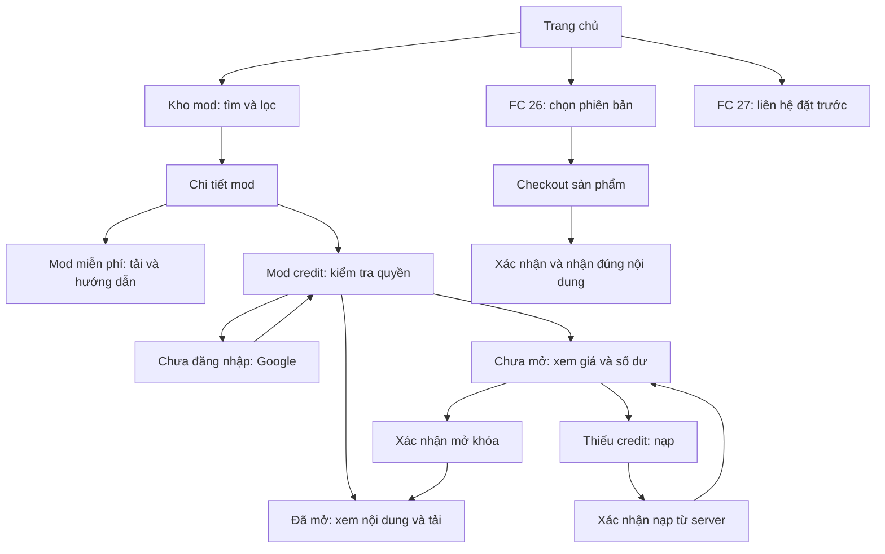

# DungDiBinhLuan — Blueprint nâng cấp UI/UX toàn diện

> Phiên bản 1.0 · Ngày lập: 23/09/2026.
> Mục đích: tài liệu bàn giao để thiết kế, triển khai và nghiệm thu giao diện toàn website.
> Trạng thái: **đề xuất nâng cấp**, chưa phải các thay đổi đã triển khai.
> Cơ sở: mã nguồn đang có trên đĩa, bao gồm những thay đổi chưa commit của dự án.

## Mục lục

1. [Phạm vi và cách đọc](#1-phạm-vi-và-cách-đọc)
2. [Định hướng sản phẩm và thiết kế](#2-định-hướng-sản-phẩm-và-thiết-kế)
3. [Bản đồ hiện trạng](#3-bản-đồ-hiện-trạng)
4. [Các vấn đề cần xử lý](#4-các-vấn-đề-cần-xử-lý)
5. [Kiến trúc thông tin và hành trình](#5-kiến-trúc-thông-tin-và-hành-trình)
6. [Design system](#6-design-system)
7. [Khung trang và điều hướng](#7-khung-trang-và-điều-hướng)
8. [Trang chủ](#8-trang-chủ)
9. [Danh mục mods](#9-danh-mục-mods)
10. [Chi tiết mod và mở khóa](#10-chi-tiết-mod-và-mở-khóa)
11. [Mix Mods](#11-mix-mods)
12. [Chọn game, thanh toán và tải xuống](#12-chọn-game-thanh-toán-và-tải-xuống)
13. [Credit](#13-credit)
14. [Tài khoản](#14-tài-khoản)
15. [Hướng dẫn, bình luận và hỗ trợ](#15-hướng-dẫn-bình-luận-và-hỗ-trợ)
16. [Quản trị](#16-quản-trị)
17. [Trạng thái và microcopy](#17-trạng-thái-và-microcopy)
18. [Responsive và accessibility](#18-responsive-và-accessibility)
19. [Ảnh, chuyển động và hiệu năng](#19-ảnh-chuyển-động-và-hiệu-năng)
20. [Kiến trúc triển khai và dữ liệu](#20-kiến-trúc-triển-khai-và-dữ-liệu)
21. [Backlog và lộ trình](#21-backlog-và-lộ-trình)
22. [Kiểm thử và nghiệm thu](#22-kiểm-thử-và-nghiệm-thu)
23. [Bàn giao và quyết định còn mở](#23-bàn-giao-và-quyết-định-còn-mở)
24. [Phụ lục nguồn](#24-phụ-lục-nguồn)

## 1. Phạm vi và cách đọc

### 1.1 Phạm vi

Bao phủ toàn bộ **31 file route giao diện `page.tsx`** hiện có: public storefront, mods, hướng dẫn, tài khoản, credit, thanh toán, tải game, đăng nhập và quản trị. Route động được tính là một template, không phải số lượng bản ghi trong database.

Đã đọc trực tiếp các luồng UI cốt lõi, CSS, component dùng chung và các hợp đồng API quan trọng; rà soát cấu trúc toàn bộ nhóm API, thư viện, schema và test để đối chiếu phụ thuộc. Tài liệu không coi việc quét cấu trúc là một cuộc kiểm toán bảo mật từng dòng của toàn bộ repository.

Không đưa dependency, output build, browser profile tạm, cache GPU, ảnh nhị phân hoặc HTML chụp từ website bên ngoài vào phạm vi mã giao diện cần thiết kế lại. Các script scraper, bảo trì dữ liệu và công cụ Python ở root là ngữ cảnh vận hành, không phải các màn hình web mới.

### 1.2 Giới hạn bằng chứng

- Đây là audit tĩnh dựa trên mã nguồn; chưa chạy một vòng kiểm thử trình duyệt toàn website trong lần lập tài liệu này.
- Các vấn đề về luồng, giá, response, token và nội dung có thể xác định từ code. Va chạm bố cục, crop ảnh, contrast sau opacity và thời gian tải thực tế phải xác nhận khi triển khai.
- `FC27-VALIDATION.md` là báo cáo kiểm tra cũ ngày 15/09/2026; không suy rộng kết quả đó sang tất cả trang hoặc trạng thái đăng nhập hiện tại.
- Những số tiền xuất hiện dưới đây là giá cấu hình tại thời điểm đọc source, không phải xác nhận giá bán ngoài hệ thống.
- Không cần thay framework hay mua thêm công cụ để bắt đầu nâng cấp này.

### 1.3 Quy ước

| Nhãn | Ý nghĩa |
|---|---|
| Hiện trạng | Có bằng chứng trong source |
| Đề xuất UI | Thay đổi bố cục, component, tương tác hoặc câu chữ |
| Phụ thuộc backend | Cần API, dữ liệu hoặc nghiệp vụ bổ sung trước khi UI hoạt động đúng |
| P0 | Sai giao dịch, quyền sử dụng hoặc thông tin trọng yếu; phải giải quyết trước khi phát hành luồng liên quan |
| P1 | Ảnh hưởng trực tiếp khả năng tìm, đọc, mua, tải hoặc điều hướng |
| P2 | Hoàn thiện thẩm mỹ, nội dung phụ và khả năng vận hành |
| P3 | Mở rộng sau khi các luồng chính ổn định |

## 2. Định hướng sản phẩm và thiết kế

### 2.1 Mục tiêu trải nghiệm

Website phải giúp người chơi trả lời nhanh năm câu hỏi:

1. Nội dung này dành cho game và phiên bản nào?
2. Tôi nhận được gì khi mua hoặc mở khóa?
3. Tôi cần trả bằng tiền, credit hay dùng quyền hiện có?
4. Sau khi thanh toán tôi nhận mã, link tải hay quyền trong tài khoản?
5. Nếu gặp lỗi, bước tiếp theo cụ thể là gì?

Vẻ chuyên nghiệp đến từ tính nhất quán, thông tin chính xác, chữ dễ đọc và trạng thái rõ ràng. Hình ảnh bóng đá là điểm nhận diện; hiệu ứng chỉ hỗ trợ việc đọc và hành động.

### 2.2 Hướng hình ảnh

**Football editorial storefront trên nền tối**, tiếp nối `NGON-NGU-THIET-KE.md`:

- Giữ nền gần đen, coral trầm, ảnh cầu thủ và sân cỏ đủ lớn.
- Public dùng bố cục biên tập, khoảng trống rộng, tiêu đề mạnh.
- Account và admin dùng cùng token nhưng mật độ cao hơn, nhiều hàng dữ liệu hơn.
- Credit dùng biểu tượng đồng xu và amber ở thông tin số dư; CTA chính vẫn dùng coral.
- Thành công dùng xanh; không biến mọi nút tải hoặc mọi card thành xanh neon.
- Mỗi khối quyết định có một CTA chính; hỗ trợ, hướng dẫn và quay lại là hành động phụ.

### 2.3 Những điểm giữ lại

- Thương hiệu DungDiBinhLuan, tiếng Việt và font Be Vietnam Pro.
- Hình ảnh FC 27 đã có trong `public/games/fc27/`.
- Cấu trúc URL hiện hành và Google OAuth.
- Cơ chế PayOS, credit, quyền mở mod, code và phân phối file hiện có; sửa hợp đồng khi phát hiện lỗi, không thay bằng mô phỏng.
- Server rendering cho nội dung public; khả năng hoạt động của FAQ native.
- Tách component account đang có là nền tảng tốt để mở rộng hệ thống UI dùng chung.

### 2.4 Những điểm thay đổi rõ rệt

- Tăng cỡ chữ nút, metadata và thông tin thanh toán đang ở mức 8–11px.
- Chuẩn hóa token, radius, khoảng cách, icon và màu trạng thái.
- Cho tìm kiếm toàn kho mod; giữ bộ lọc trong URL.
- Đồng bộ hình thức mua và nội dung nhận được trên mọi màn.
- Có phương án hồi phục cho lỗi dữ liệu, thanh toán chậm, link hết hạn và phiên hết hạn.
- Biến admin thành không gian làm việc thống nhất, giảm biểu mẫu lặp và dashboard quá dài.

## 3. Bản đồ hiện trạng

### 3.1 Công nghệ đang dùng

Next.js 16.1.6, React 19.2.3, TypeScript, Tailwind CSS v4; Supabase cho dữ liệu và đăng nhập; Redis cho mã/đơn game; PayOS cho thanh toán; R2 cho media và file; Tiptap cho bài viết. Đây là thông tin từ `package.json` và source, không phải đề xuất nâng phiên bản.

### 3.2 Route inventory

| Khu vực | Route hiện có | Vai trò và hướng nâng cấp |
|---|---|---|
| Trang chủ | `/` | Chiến dịch FC 27, cổng vào FC 26, mods, bài viết |
| Kho mod | `/mods` | Tìm kiếm, lọc, phân trang, featured |
| Chi tiết | `/mods/[slug]` | Mod miễn phí, credit hoặc nhánh Mix Mods |
| Mix Mods checkout | `/mods/mix-mods-fc26/payment` | Mua sản phẩm bằng VND |
| Chọn game | `/games/fc26/select` | So sánh Standard và Full Mods |
| Thanh toán game | `/games/fc26/payment` | Chọn theo query `edition` |
| Kích hoạt | `/games/fc26` | Nhập code và hiển thị khu tải |
| Tải game | `/games/fc26/download` | Link tải game |
| Tải game/mods | `/games/fc26/download-mods` | Hai loại file |
| Kết quả mua | `/payment/success`, `/payment/cancel` | Xác nhận và phục hồi giao dịch |
| Nạp credit | `/credit` | Gói nạp, số tiền tùy chỉnh |
| Kết quả nạp | `/credit/success`, `/credit/cancel` | Đối chiếu đơn và số dư |
| Tài khoản | `/account` | Bảy section bằng state phía client |
| OAuth | `/auth/callback` | Hoàn tất đăng nhập, trở về trang trước |
| Hướng dẫn | `/huong-dan`, `/huong-dan/[slug]` | Danh sách và bài đọc |
| Báo cáo | `/dmca` | Thông tin tiếp nhận báo cáo |
| Admin auth | `/admin` | Đăng nhập quản trị |
| Admin chính | `/admin/dashboard` | Truy cập nhanh, role, membership, plan, form mod |
| Mods admin | `/admin/mods`, `/admin/mods/new`, `/admin/mods/[slug]/edit` | CRUD và giá mở khóa |
| Showcase admin | `/admin/mods/[slug]/showcase` | Upload, chú thích, sắp xếp ảnh |
| Guides admin | `/admin/guides`, `/admin/guides/new`, `/admin/guides/[id]/edit` | Danh sách và editor |
| Cộng đồng admin | `/admin/community` | Duyệt, ghim, xóa |
| Tạo mã | `/admin/generate` | Tạo code theo loại |
| Scraper | `/admin/scraper` | Nguồn, nội dung chờ duyệt, xuất bản |

### 3.3 Các mô hình thương mại phải tách rõ

| Loại | Nguồn hiện tại | Giao diện cần nói gì |
|---|---|---|
| Đặt trước FC 27 | Giá trong `app/page.tsx`, liên hệ Facebook | Liên hệ đặt trước; xác nhận gói với hỗ trợ |
| FC 26 Standard | `PRODUCTS['fc26-normal']` | Thanh toán VND, nhận code game |
| FC 26 Full Mods | `PRODUCTS['fc26-mods']` | Thanh toán VND, nhận code loại mods |
| Mix Mods | `PRODUCTS['mix-mods']`, `noCode: true` | Nhận link tải theo quy trình sản phẩm; không hứa code |
| Mở từng mod | `mod_unlock_prices`, `mod_access`, ví credit | Giá credit, số dư, quyền đã mở |
| Membership | `membership_plans`, `subscriptions`, role | Tên gói, thời hạn, quyền lợi đã được hệ thống hỗ trợ |

Giá source tại thời điểm audit: FC 27 là 180.000đ; Standard 69.000đ; Full Mods 199.000đ; Mix Mods 169.000đ. Chuyển các giá hiển thị trùng lặp về cấu hình dùng chung trước khi thay thiết kế.

## 4. Các vấn đề cần xử lý

### 4.1 Giao dịch và quyền sử dụng

| ID | Mức | Bằng chứng | Tác động | Hướng xử lý |
|---|---|---|---|---|
| A01 | P0 | `/credit/success` đọc `data.data.paid`; `/api/credit/topup/order` trả `paid` ở root | Thanh toán đã ghi nhận vẫn có thể hiện chờ | Đồng bộ response và thêm test hợp đồng client/API |
| A02 | P0 | Unlock wall hứa mod nằm vĩnh viễn; API account/unlocks/spend có xóa `mod_access` quá 60 ngày | Lời hứa không khớp cơ chế quyền | Chốt chính sách; tách quyền sở hữu khỏi lịch sử; không chỉ sửa dòng chữ để che lỗi |
| A03 | P0 | Mix Mods config `noCode: true`; checkout vẫn ghi nhận key/code | Khách chờ sai loại thông tin sau mua | Dùng thông tin fulfillment từ product config xuyên suốt checkout, kết quả, email |
| A04 | P0 | `/payment/success` coi `CODE_GENERATED` là hoàn tất gửi email | Email có thể chưa gửi nhưng UI nói đã gửi | Tách thanh toán, cấp nội dung và gửi email thành các trạng thái |
| A05 | P1 | Mọi nút nâng cấp membership trong account đều tới checkout Mix Mods | Chọn gói A nhưng mở trang mua sản phẩm khác | Chưa có checkout membership đúng thì dùng liên hệ tư vấn; không giả lập mua gói |
| A06 | P1 | `OrdersSection` nhận `subscriptions`, không phải tất cả giao dịch | Nhãn “Đơn hàng” khiến người dùng hiểu sai phạm vi | Đổi nhãn thành lịch sử membership hoặc bổ sung API lịch sử giao dịch hợp nhất |
| A07 | P1 | `/account?section=credit` được link tới nhưng account khởi tạo `overview` và không đọc query | Sau nạp không vào đúng ví | Đồng bộ section với URL và Back/Forward |
| A08 | P1 | Hai trang success giữ checking nếu thiếu `orderCode`; timeout lặp chưa cleanup toàn bộ | Mắc kẹt loading hoặc request sau khi rời trang | Thêm invalid-order, lỗi mạng, hết phiên, retry; hủy mọi timer/request |
| A09 | P1 | Credit UI chỉ kiểm tra mức tối thiểu khi nhập; core còn có max và bội số 10.000 | Bấm thanh toán rồi mới nhận lỗi có thể báo sớm | Dùng `validateTopupAmount` trên client và server |
| A10 | P1 | `PackageCard` tính tỷ lệ bonus trên tổng credit, còn core tính trên credit gốc | Nhãn phần trăm không khớp quy tắc +10% | Hiển thị base + bonus = total; lấy phần trăm từ rule |

**Điều kiện kỹ thuật đi kèm UI:** API tải game hiện tạo URL sau kiểm tra rate limit; việc giấu nút sau nhập code không tự tạo quyền tải phía server. Khi làm lại khu tải, đối chiếu quyền ở endpoint trước khi ghi nhận luồng đã được bảo vệ. Đây là phụ thuộc chức năng, không phải hạng mục đổi màu.

### 4.2 Khả năng tìm nội dung và tính nhất quán

| ID | Mức | Bằng chứng | Hướng xử lý |
|---|---|---|---|
| B01 | P1 | `ModsClient`: search chỉ xuất hiện và lọc khi `activeTag === 'Faces'` | Tìm toàn kho, kết hợp bộ lọc, tìm không dấu |
| B02 | P1 | Catalog nối static + DB không dedupe; homepage dùng Map; detail ưu tiên static | Một slug chỉ có một item, thống nhất nguồn ưu tiên |
| B03 | P1 | ModCard/detail/featured nối `var(--color-accent)` với `1A`, `20`, `4D` | CSS màu không hợp lệ ở các nhánh token; dùng token tint hoặc `color-mix` |
| B04 | P1 | Account và admin dùng `signal`, globals không định nghĩa token tương ứng | Migrate sang violet hoặc bổ sung alias có chủ đích |
| B05 | P1 | Nhiều nền `#0a0e0c`, `#050507`, hover `#46d98a`, glow `110,242,160` | Migrate theo component, không thay chuỗi toàn repo thiếu kiểm tra |
| B06 | P1 | Giá, CTA, metadata nhiều nơi 8–11px | Áp type scale mới, giảm chữ hoa/tracking |
| B07 | P1 | Messenger `z-[9999]`; lightbox 90; drawer 50; sticky buy 60 | Quy định layer và ẩn hỗ trợ khi modal mở |
| B08 | P1 | Mod search thiếu label rõ; pagination thiếu `aria-current`; dropdown ẩn bằng opacity | Bổ sung semantics, bỏ phần ẩn khỏi focus order |
| B09 | P1 | Wallet packages lỗi vẫn có thể skeleton vì suy loading từ length; transaction lỗi bị bỏ qua | Tách loading/error/empty theo từng resource |
| B10 | P1 | Trang download thiếu catch và kiểm tra `response.ok` đầy đủ | Lỗi từng file có retry; không render anchor URL null |
| B11 | P2 | Card guide dùng title lần thứ hai làm mô tả | Dùng excerpt thật hoặc bỏ mô tả |
| B12 | P1 | Bài guide dùng nhiều `prose-*`; package/CSS chưa có typography plugin tương ứng | Tạo ArticleBody CSS hoàn chỉnh và kiểm tra computed style |
| B13 | P2 | Header account thêm `pt-20/md:pt-24` trong khi root đã bù navbar | Chuẩn hóa một nguồn offset, đo lại khoảng mở đầu |
| B14 | P1 | Membership empty link `/lien-he` chưa có route | Dùng kênh hỗ trợ đang có hoặc tạo route riêng có nội dung thật |
| B15 | P1 | Membership redeem chỉ hiện thông báo TODO | Ẩn thao tác chưa hoạt động; không hứa có thể kích hoạt membership bằng code game |

### 4.3 Độ tin cậy của nội dung

- `FlashSaleBanner` tạo ngày kết thúc bằng thời điểm khởi tạo module + 7 ngày: không phải deadline chiến dịch ổn định. Chỉ hiển thị countdown khi có thời điểm kết thúc thực và chính sách giá đi kèm.
- Chi tiết Mix Mods lấy ngày hôm nay làm ngày cập nhật: dùng ngày phát hành bản mod thật.
- Số lượng faces khác nhau giữa highlights, slider và gói Full Mods: cần xác định đang nói cùng sản phẩm hay khác sản phẩm; lưu số liệu theo sản phẩm/phiên bản và nguồn xác nhận.
- “Powered by Google Antivirus”, “an toàn”, “hỗ trợ 24/7”, “trả lời trong vài phút”, “trọn đời” cần bằng chứng hoặc chính sách vận hành. Không tự nhân rộng chúng trong giao diện mới.
- CreditTopUpModal có package hardcode khác core và nút alert placeholder; hiện chưa tìm thấy nơi import sử dụng. Không coi đây là checkout đang hoạt động; bỏ hoặc hợp nhất nếu đưa lại vào sản phẩm.
- HeroSection/WorldCupBanner cũ cần kiểm tra reference trước khi bảo trì; homepage hiện render trực tiếp trong `app/page.tsx`.

## 5. Kiến trúc thông tin và hành trình

### 5.1 Điều hướng cấp cao

Public: **FC 27 · FC 26 · Kho mod · Hướng dẫn**. “Game khác” có thể nằm trong menu mở rộng hoặc section trang chủ. Facebook là kênh hỗ trợ/cộng đồng với nhãn đúng loại đích đến, không mặc định gọi fanpage là group.

Tài khoản: **Tổng quan · Mod đã mở · Ví credit · Membership · Lịch sử · Hồ sơ · Đăng nhập & bảo mật**. Nhóm hành động thường dùng trước phần cài đặt cá nhân.

Admin: **Tổng quan · Mods · Bài hướng dẫn · Bình luận · Thành viên · Membership · Mã truy cập · Scraper**. Ba mục chưa có route riêng là đề xuất tách từ dashboard, không được tạo liên kết chết trước khi có trang.

### 5.2 Hành trình chính



### 5.3 Quy tắc bảo toàn ngữ cảnh

- Search, filter, sort, page nằm trong query string.
- Đăng nhập xong trở lại đúng URL và section đang thao tác.
- Nạp credit từ mod lưu đường dẫn quay lại; sau nạp hiển thị “Quay lại mở [tên mod]”. Không tự trừ credit sau redirect.
- Hủy thanh toán trở về checkout sản phẩm tương ứng, không dùng `router.back()` làm đích duy nhất vì có thể quay lại cổng thanh toán.
- Dữ liệu form không mất khi API lỗi; không lưu token hay thông tin bí mật vào draft.
- `next`/`returnTo` chỉ nhận đường dẫn nội bộ hợp lệ, loại URL protocol-relative và đích ngoài domain.

## 6. Design system

### 6.1 Màu

Giữ primitives hiện tại, chuẩn hóa cách sử dụng:

| Semantic | Giá trị/nguồn | Áp dụng |
|---|---|---|
| Canvas | `#090a0f` | Nền toàn trang |
| Surface 1 | `#14131b` | Card và panel |
| Surface 2 | `#201c26` | Hover, input nổi, selected trung tính |
| Accent | `#cf5c69` | CTA chính, nhấn giá sản phẩm |
| Accent hover | `#dd7480` | Hover/focus tương ứng |
| On accent | `#100c10` | Chữ trên nút coral |
| Title | `#f4f5f7` | Heading, dữ liệu quan trọng |
| Body | `#b6bcc9` | Đoạn văn |
| Muted | `#9499a8` | Thông tin phụ, không giảm opacity tùy ý |
| Violet | `#8f7bf7` | Thư viện, profile khi cần phân biệt |
| Success | `#3ddc97` | Thành công có nhãn |
| Warning | `#f4b860` | Chờ xử lý, cần chú ý |
| Danger | `#f45d6a` | Lỗi và hành động phá hủy |
| Credit | Alias amber riêng | Icon, số dư, đơn vị credit |

Thêm `accent-subtle`, `accent-border`, `credit-subtle`, `credit-border`, `focus-ring`, `overlay`. Tạo tint từ token bằng CSS hợp lệ. Không nối alpha vào chuỗi `var(...)`.

Không dùng màu category làm nền toàn bộ CTA. Category label ưu tiên nền trung tính; nếu dùng màu phải có cùng map giữa catalog/detail/admin.

### 6.2 Typography đề xuất

Đây là thay đổi có chủ đích so với typography nhỏ trong tài liệu FC 27 trước đó; khi triển khai phải cập nhật tài liệu canonical cùng lúc.

| Vai trò | Desktop | Mobile | Weight / line-height |
|---|---:|---:|---|
| Display campaign | 72–104px | 48–64px | 900 / 1.05 |
| H1 trang thường | 36–44px | 28–32px | 700–900 / 1.2 |
| H2 | 28–32px | 22–26px | 700 / 1.3 |
| H3 | 20–22px | 18–20px | 700 / 1.4 |
| Body | 16px | 15–16px | 400 / 1.65 |
| Bài hướng dẫn | 17–18px | 16px | 400 / 1.8 |
| Label/button | 14–16px | 14–16px | 500–700 / 1.4 |
| Metadata | 12–13px | 12–13px | 400–500 / 1.5 |
| Giá chính | 32–40px | 28–32px | 700–900 / 1.15 |

- Giữ các weight đã load 400/500/700/900; nếu thêm 600 phải có lý do và kiểm tra tải font.
- Chữ hoa chỉ dành cho eyebrow ngắn; không dùng uppercase tracking rộng cho toàn bộ form.
- Tiêu đề mod tối đa hai dòng ở card, đầy đủ ở detail.
- Số tiền, credit, mã đơn dùng tabular numbers; mã dài cho phép copy và wrap.
- Body trong bài viết tối đa khoảng 65–75 ký tự/dòng.

### 6.3 Khoảng cách và kích thước

| Hạng mục | Quy ước |
|---|---|
| Spacing scale | 4, 8, 12, 16, 20, 24, 32, 40, 48, 64, 80px |
| Container public | 1200px; catalog/admin tối đa 1280–1440px khi nội dung cần |
| Gutter | 16px ở 320px, 20px điện thoại rộng, 24px tablet, 32px desktop |
| Section gap | 64–80px desktop; 40–48px mobile |
| Card padding | 20–24px desktop; 16–20px mobile |
| Radius | Input/button 10px; card 16px; modal 20px; badge pill |
| Input | Cao 48px; multiline tối thiểu 120px |
| Button | 44px mặc định; primary checkout 48–52px |
| Icon | 16/20/24px; một hệ stroke SVG nhất quán |

Không dùng quá một card có nền riêng bên trong một card lớn trừ trường hợp form hoặc nội dung cần nhóm rõ. Dùng divider cho hàng metadata thay cho nhiều badge viền.

### 6.4 Bộ component nền tảng

| Component | Variants và yêu cầu |
|---|---|
| Button / ButtonLink | Primary, secondary, ghost, danger; loading giữ width; link dùng anchor, không lồng button trong anchor |
| IconButton | Nhãn đọc màn hình bắt buộc, vùng bấm 44px |
| Field | Label, hint, error, required, disabled, readonly; nối ID chính xác |
| Select / RadioGroup | Gói nạp và phiên bản có selected state, hỗ trợ keyboard |
| Badge | Neutral, accent, success, warning, danger; không chỉ khác màu |
| Card | Default, interactive, selected; hover chỉ dùng với phần tương tác |
| SectionHeader | Eyebrow tùy chọn, title, description, action |
| Breadcrumb | Semantic nav, current page, wrap trên mobile |
| EmptyState | Lý do rỗng và hành động phù hợp |
| ErrorState | Lỗi có thể hiểu và retry đúng resource |
| Skeleton | Đúng hình dạng bố cục cuối, không dùng spinner toàn màn cho mọi thứ |
| Dialog / Drawer | Focus trap, restore focus, Escape, khóa scroll, nhãn, safe-area |
| Toast / InlineNotice | Toast cho tác vụ phụ; trạng thái tiền/quyền luôn có khối bền vững |
| Pagination | Current page, prev/next, giới hạn page; khôi phục scroll vùng kết quả |
| ArticleBody | Heading, list, ảnh, code, bảng, blockquote; style tường minh |
| DataTable | Sorting nếu có dữ liệu hỗ trợ, empty/error, hàng đang lưu, mobile representation |

### 6.5 Layer và motion

Thứ tự đề xuất: nội dung 0 → sticky trong trang 10 → navbar 30 → sticky action 40 → popover 50 → hỗ trợ nổi 60 → overlay 80 → modal/lightbox 90 → thông báo cần thiết 100.

Khi modal mở, hỗ trợ nổi phải ẩn hoặc inert. Không sửa bằng cách tăng mọi z-index lên 99999.

Hover/focus 150–180ms; dialog 180–220ms. Reduced motion tắt chuyển động dịch/zoom, autoplay bằng timer và loop video, không chỉ rút ngắn CSS animation.

## 7. Khung trang và điều hướng

### 7.1 Navbar

Desktop: logo → điều hướng chính → credit nếu đăng nhập → account → hỗ trợ gọn. Link admin nằm trong account menu và vẫn truy cập được trên mobile.

Mobile: logo gọn → chip credit gọn → account/login → menu. Chuyển “Uy tín” và social links vào menu khi thiếu chỗ, không thu nhỏ chữ để ép mọi nút vào một hàng.

Yêu cầu:

- Có active state theo route; `aria-current` cho mục hiện hành.
- Giữ breakpoint thu gọn 1280px làm điểm xuất phát vì thương hiệu dài; điều chỉnh theo nội dung thực.
- Menu dạng disclosure: Escape đóng, đóng khi chọn link/chuyển route; nếu chuyển thành drawer modal phải trap focus.
- Loading auth giữ kích thước cố định, tránh đẩy menu; login lỗi mở lại nút và hiện thông báo.
- Credit chip ghi rõ đơn vị, số dư lỗi hiển thị “Chưa tải được” hoặc trạng thái gọn có nhãn; không tự biến lỗi thành 0.
- Bỏ pulse đỏ chỉ vì số dư dưới 10; thông báo thiếu credit trong ngữ cảnh mua mod cụ thể.

### 7.2 Footer

Tách footer trang chủ thành component public dùng chung:

1. Thương hiệu và mô tả ngắn.
2. Khám phá: FC 26, mods, hướng dẫn.
3. Hỗ trợ: kênh liên hệ thật, hướng dẫn nhận nội dung.
4. Báo cáo: `/dmca`.

Checkout dùng footer rút gọn; admin không cần footer marketing. Không thêm link chính sách chưa có nội dung.

### 7.3 Hỗ trợ nổi

- Nút 48px, cách mép 16–24px; đặt trên sticky action một khoảng đủ nhìn.
- Popup rộng `min(340px, viewport - 32px)` thay vì cố định gây tràn.
- Chỉ render nội dung tương tác khi mở; có `aria-expanded` và Escape.
- Liên hệ mở bằng link có fallback nếu popup bị chặn.
- Mô tả “Mở Messenger để trao đổi với hỗ trợ”; thời gian trả lời chỉ hiển thị khi có căn cứ vận hành.
- Trong checkout, ưu tiên link hỗ trợ cạnh thông tin đơn, tránh chat che CTA.

## 8. Trang chủ

### 8.1 Mục tiêu

FC 27 giữ vai trò chiến dịch chính theo source hiện tại; người dùng FC 26/mods vẫn có lối vào ngay gần hero. Trạng thái nhận đặt trước cần được chủ sản phẩm xác nhận trước lúc phát hành giao diện mới; không suy ra lịch phát hành từ tên ảnh.

### 8.2 Thứ tự nội dung

1. Announcement ngắn, chỉ có khi chiến dịch hoạt động.
2. Hero FC 27: tên game, thông điệp, trạng thái, giá, CTA.
3. Lối tắt FC 26 / Kho mod / Hướng dẫn.
4. Khối đặt trước với những thông tin đã xác nhận.
5. FC 26 với CTA chọn phiên bản và liên kết nhập code.
6. Mods cập nhật gần đây.
7. Hướng dẫn nổi bật.
8. Game khác khi có nội dung thực.
9. FAQ.
10. Footer và liên hệ cuối trang gọn.

### 8.3 Wireframe desktop

```text
[Logo] [FC 27] [FC 26] [Kho mod] [Hướng dẫn]        [Ví] [Tài khoản]
------------------------------------------------------------------
FC 27 · trạng thái chiến dịch                 ẢNH CHỦ ĐẠO
Mùa giải mới. Đam mê tiếp nối.                có vùng crop riêng
Giá / thông tin gói đã xác nhận               không chèn giá vào ảnh
[Xem thông tin đặt trước] [Khám phá FC 26]
------------------------------------------------------------------
[FC 26: chọn phiên bản] [Kho mod] [Hướng dẫn cài đặt]
------------------------------------------------------------------
[Ảnh minh họa / thông tin]   [Giá + điều kiện + Liên hệ đặt trước]
------------------------------------------------------------------
FC 26 đang có     [Chọn phiên bản] [Đã có code]
Mods mới         [Card] [Card] [Card] [Card]
Hướng dẫn        [Bài chính] [Danh sách bài]
FAQ              [Câu hỏi có thể mở]
Footer
```

### 8.4 Chi tiết thiết kế

- Hero có chiều cao theo nội dung; không ép chữ nhỏ để giữ hình ở 320px.
- Desktop ảnh khoảng 55–60%, nội dung 40–45%; mobile ảnh và chữ có bố cục riêng.
- CTA chính cao 52px, chữ 15–16px; giá 32–40px; dòng trạng thái tối thiểu 12px.
- Giữ mặt cầu thủ và các điểm quan trọng khi crop; overlay chỉ dày ở vùng chữ.
- “Liên hệ đặt trước” ghi rõ mở Facebook; không hiện trạng thái đơn thanh toán vì chưa có checkout FC 27.
- Mods trang chủ dùng cùng data adapter và card family với catalog; có thể dùng variant editorial nhưng không đổi cách ghi giá/quyền.
- Bài viết không có thumbnail dùng placeholder có chủ đích; không lấy ảnh ngẫu nhiên.
- FAQ dùng `details/summary`, focus rõ; chỉ mở nhiều câu nếu nội dung không gây quá dài.

### 8.5 Nghiệm thu

- Trong màn đầu người dùng hiểu sản phẩm, trạng thái và hành động tiếp theo.
- FC 26 và kho mod tìm thấy trong một thao tác điều hướng.
- Ảnh, giá, FAQ, metadata và CTA không mâu thuẫn nhau.
- Không có chữ CTA 8–9px hoặc phần hero tràn ở 320px.
- Khi API guide lỗi, khối còn lại vẫn hữu ích; lỗi không bị coi là có 0 bài một cách âm thầm.

## 9. Danh mục mods

### 9.1 Bố cục

Đầu trang có H1 nhìn thấy được “Kho mod”, mô tả một dòng, search toàn kho. Featured là khối gợi ý vừa phải, không đẩy công cụ tìm quá sâu.

```text
Kho mod FC 26
[Tìm tên mod, cầu thủ, tác giả…                         X]
[Tất cả] [Faces] [Kits] [Gameplay] [Đồ họa] [Cơ chế game]
[Bộ lọc đang chọn]                      [Sắp xếp: Mới cập nhật]
Đang hiển thị 1–20 / N mod
[Card] [Card] [Card] [Card]
…
[Trước] [1] [2] […] [Tiếp]
```

### 9.2 Search và filter

- Tìm trong tên, mô tả ngắn, tác giả, tags; hỗ trợ tiếng Việt không dấu bằng hàm normalize.
- Search hoạt động với mọi category; đổi category giữ keyword và reset page về 1.
- URL đề xuất: `/mods?q=messi&tag=Faces&sort=updated&page=2`.
- Dùng replace khi gõ tìm, push khi người dùng đổi trang; debounce khoảng 250–300ms nếu cần request.
- Khi còn xử lý dữ liệu nhỏ tại client, tránh thêm request mỗi ký tự không cần thiết.
- Sắp xếp khả dụng: mới cập nhật, tên A–Z. Không thêm “phổ biến nhất” khi chưa có metric thật.
- Filter miễn phí/credit chỉ xuất hiện khi mọi item đã có loại giá đáng tin cậy; không mặc định thiếu `credit_cost` nghĩa là miễn phí cho cả Mix Mods.
- Tương thích game/TU là filter giai đoạn sau nếu schema chưa có trường chuẩn.

### 9.3 Mod card

Thứ tự: ảnh → category ngắn → tên → mô tả tối đa hai dòng → version/ngày → giá hoặc quyền → tác giả.

- Ảnh landscape 16:10; ảnh portrait nằm trong khung cùng tỷ lệ với contain. Ưu tiên nền tĩnh để giảm ảnh backdrop trùng.
- Đặt trạng thái giá ở vị trí ổn định: “Miễn phí”, “5 credit”, “Đã mở” hoặc “169.000đ”. Không dùng “VIP” để thay thế mọi loại trả phí.
- Không làm tác giả uppercase 9px. Cho wrap hoặc truncate có cách đọc đầy đủ.
- Một card là một link; nút độc lập sau này phải tránh lồng tương tác.
- Ảnh lỗi chuyển sang fallback vẫn giữ tỷ lệ; tiêu đề và link luôn còn.
- Grid đề xuất: 1 cột 320–479px; 2 cột 480–767px; 3 cột tablet; 4 cột desktop; chỉ 5 cột khi card còn đủ rộng.

### 9.4 Dữ liệu và trạng thái

- Dedupe theo slug trước filter/count/pagination.
- Thống nhất DB ưu tiên cho metadata khi có record hợp lệ; static làm fallback. Đây là quyết định migration cần áp dụng đồng thời homepage, catalog, detail và metadata.
- Nếu có featured, quy định count có tính featured hay không; nội dung trang không lặp lại cùng slug.
- Danh sách static vẫn hiển thị khi DB cập nhật lỗi; có notice “Một số mod mới chưa tải được” và retry.
- No-results hiển thị keyword + bộ lọc và nút “Xóa bộ lọc”; không dùng cùng trạng thái với lỗi server.
- Pagination đưa focus về heading kết quả, không luôn cuộn về đỉnh site.

## 10. Chi tiết mod và mở khóa

### 10.1 Template chung

Desktop: breadcrumb → hero hai cột gồm gallery 60% và summary/action 40% → nội dung → hướng dẫn → mods liên quan.

Mobile: breadcrumb → tên/metadata → ảnh → giá/quyền/CTA → nội dung → hướng dẫn → gợi ý.

Summary phải có tên, tác giả, version mod, ngày cập nhật thật, game/TU nếu có dữ liệu, loại quyền và hành động. Phân biệt version mod với version game.

### 10.2 Ma trận trạng thái truy cập

| Trạng thái | Hiển thị | CTA |
|---|---|---|
| Đang kiểm tra | Summary public + skeleton action | Chưa cho mở khóa |
| Mod miễn phí | Thông tin public, link nếu có | Tải mod |
| Khách chưa đăng nhập | Tên, ảnh, giá, giải thích lưu quyền | Đăng nhập để mở khóa |
| Đã đăng nhập, đủ credit | Giá, số dư, số dư sau khi mở | Mở khóa với X credit |
| Thiếu credit | Giá, số dư, còn thiếu X | Nạp credit |
| Số dư chưa tải được | Không giả định bằng 0 | Thử tải lại số dư |
| Đang mở | Giữ summary, báo đang xử lý | Disable chống double submit |
| Đã mở | Badge đã mở, nội dung được cấp quyền | Tải mod |
| Đã mở, content lỗi | Giữ xác nhận quyền, báo lỗi tải nội dung | Tải lại nội dung; không trả tiền lại |
| Chưa có link tải | Thông tin phiên bản và thông báo rõ | Liên hệ hỗ trợ |
| Phiên hết hạn | Giữ ngữ cảnh | Đăng nhập lại |

### 10.3 Paywall có thông tin hữu ích

Đề xuất cho người dùng xem tóm tắt công khai và ảnh preview trước khi mua; nội dung premium/link tải tiếp tục được server kiểm quyền. Vì hiện wall khóa cả phần mô tả chi tiết, việc mở thêm preview cần phân loại trường public/protected, không lấy toàn bộ content về rồi dùng CSS che.

Xác nhận mở khóa nên cho thấy tên mod, X credit sẽ trừ, số dư dự kiến còn lại. Quyền thực tế và số dư cuối cùng lấy từ server. Khi response không rõ do mất mạng, kiểm tra quyền trước khi cho thử lại thao tác trừ tiền.

### 10.4 Gallery

- Thumbnail rõ selected; ảnh lớn có caption khi có.
- Lightbox hỗ trợ đóng, trước/sau, keyboard, counter, focus trap/return focus.
- Mobile swipe là bổ sung, vẫn có nút điều hướng.
- Lỗi tải ảnh không đóng lightbox ngoài ý muốn.
- Nếu chưa có showcase, không dựng một gallery rỗng lớn trên public; có thể chỉ giữ cover.

## 11. Mix Mods

Trang bán flagship cần có câu chuyện riêng nhưng sử dụng hệ component chung.

### 11.1 Cấu trúc đề xuất

1. Hero: tên bộ mod, game hỗ trợ, ảnh tốt nhất, giá VND, CTA “Mua Mix Mods”.
2. Khối “Bạn nhận được gì”: tối đa 4–6 quyền lợi xác nhận được.
3. Showcase ảnh thật với caption nói rõ thay đổi.
4. Nhóm tính năng: faces, kits, gameplay, đồ họa, camera.
5. Video click-to-play.
6. Tương thích, yêu cầu cài đặt và thứ tự cài.
7. Nội dung gói, cách nhận, phạm vi hỗ trợ/cập nhật.
8. FAQ và CTA cuối trang.

### 11.2 Những chỉnh sửa quan trọng

- Dùng giá từ `lib/payment/config.ts`, không giữ `PRICE` riêng tại detail, payment, sticky.
- Không cập nhật ngày tự động mỗi lần render.
- Thay các chỉ số faces khác nhau bằng số liệu theo phiên bản; nếu chưa rõ, mô tả định tính không có số.
- Slider chuyển sang chọn thủ công hoặc grid tính năng. Nếu vẫn autoplay, có pause rõ và dừng khi focus/reduced motion.
- Video Vimeo không tự tải/phát lặp ngay khi vào trang; cover và nút play trước.
- Nhãn “Liên hệ mua” đang dẫn checkout đổi thành nhãn phản ánh đúng hành động.
- Không gọi Mix Mods là membership nếu quy trình chỉ mua sản phẩm một lần.
- Sticky bar mobile hiện sau khi CTA hero rời viewport; ẩn khi CTA chính đang thấy. Dùng quan sát phần tử thay vì phụ thuộc ngưỡng scroll 360px cố định.
- Khi sticky bar ẩn, link bên trong cũng phải rời thứ tự focus; `aria-hidden` đơn lẻ chưa đủ.

## 12. Chọn game, thanh toán và tải xuống

### 12.1 Chọn phiên bản FC 26

Desktop hai card cùng chiều cao và bảng so sánh ngắn; mobile xếp dọc, mỗi card có CTA riêng.

Thông tin bắt buộc: tên edition, loại nội dung, giá, bao gồm/không bao gồm, cách nhận, phạm vi hỗ trợ đã xác nhận. Nếu chế độ chơi hoặc hình thức kích hoạt chưa được xác minh, không tự bổ sung vào copy.

Giá cũ và phần trăm giảm chỉ hiển thị khi có dữ liệu chiến dịch có hiệu lực. Dùng một token accent, phân biệt edition bằng tên và nhãn thay vì hai màu CTA mạnh cạnh tranh.

Có link “Đã có code? Nhập code” ngay dưới vùng chọn. Query edition không hợp lệ hiển thị lựa chọn lại, không âm thầm mua nhầm gói mặc định.

### 12.2 Checkout dùng chung

```text
Chọn phiên bản → Thanh toán → Nhận nội dung

[Thông tin người nhận]                 [Tóm tắt sản phẩm]
Email nhận mã/link                     Ảnh nhỏ + tên edition
Giải thích cách nhận                   Quyền lợi / loại fulfillment
[Thanh toán qua PayOS]                 Giá và tổng thanh toán

[Chuyển khoản thủ công — mở chi tiết]
[Hỗ trợ về thanh toán]
```

Mobile đặt tóm tắt đơn ngắn trước form, chi tiết bổ sung mở rộng bên dưới. Email có label, hint, lỗi gắn field; giữ email khi lỗi. CTA phải chứa tổng tiền hoặc đặt tổng tiền ngay cạnh, không khiến người dùng phải cuộn tìm lại.

PayOS là phương thức chính nếu hoạt động. Chuyển khoản thủ công nằm trong disclosure riêng với số tài khoản, người nhận, số tiền, nội dung CK và copy từng trường. QR giữ contain và nền trắng đủ khoảng, không crop.

Các bước hậu thanh toán phân biệt:

- Game có code: xác nhận thanh toán → cấp code → gửi email → nhập code → tải/cài.
- Mix Mods không code: xác nhận → cấp nội dung/link theo chính sách → hướng dẫn cài.
- Chuyển khoản thủ công: gửi chứng từ → chờ hỗ trợ đối chiếu; không hiển thị như đã tự xác nhận.

### 12.3 Màn kết quả

Các trạng thái chuẩn: checking, pending, paid-awaiting-fulfillment, fulfilled, delivery-issue, cancelled, invalid-order, unauthorized, network-error.

Không có mã đơn: “Không tìm thấy thông tin giao dịch” cùng đường về đúng checkout. Mất mạng: “Chưa kiểm tra được trạng thái”, giữ mã đơn, nút kiểm tra lại. Chờ lâu: không hướng khách thanh toán lần nữa ngay.

Thành công cho biết **đã hoàn tất phần nào**, có mã đơn để copy và CTA tiếp tục đúng sản phẩm. Chỉ ghi email đã gửi khi server xác nhận gửi thành công. Thời gian xử lý không hứa một con số mới nếu vận hành chưa cam kết.

### 12.4 Nhập code và tải file

- Heading “Nhập mã truy cập FC 26”; input có label, paste được, trim khoảng trắng.
- Không xóa code khi lỗi định dạng hoặc lỗi mạng; người dùng phải sửa được ký tự.
- Tách lỗi không hợp lệ, hết hạn nếu backend biết, rate limit và mất kết nối.
- Sau xác minh: heading theo edition thực tế server trả; danh sách file được phép lấy từ quyền.
- File card gồm tên, loại, dung lượng đã xác nhận, phiên bản, CTA và hướng dẫn.
- Trạng thái từng file: idle → creating-link → ready/opening → error/expired. Một file lỗi không khóa file khác.
- Có “Tạo lại liên kết” sau hết hạn; không ghi tải hoàn tất khi mới mở URL.
- Hướng dẫn cài và liên hệ hỗ trợ ở sau vùng tải; không phủ nhiều cảnh báo màu đậm cạnh tranh.
- Dung lượng `~57GB` hardcode và dữ liệu `GAMES` cần hợp nhất để không hiển thị hai con số cho cùng bộ cài.

## 13. Credit

### 13.1 Trang nạp

Desktop chia 2/3 vùng chọn gói và 1/3 tóm tắt; mobile một cột, tóm tắt sát CTA.

1. Header “Nạp credit”, giải thích dùng để mở mod.
2. Số dư hiện tại nếu đăng nhập; khách thấy trạng thái cần đăng nhập.
3. Gói nạp dạng radio cards.
4. Số tiền tùy chỉnh với validation ngay dưới field.
5. Bảng tính: tiền thanh toán → credit gốc → tặng thêm → tổng nhận.
6. CTA PayOS và thông tin cách cập nhật số dư.

Ví dụ theo core hiện tại: 100.000đ = 100 credit gốc + 10 credit tặng = 110 credit. 200.000đ tương ứng 220 credit, không phải 230 như component modal cũ.

### 13.2 Quy tắc form

- Packages lấy từ `/api/credit/prices`; không copy mảng giá sang component mới.
- Dùng min/max/bước tiền trong core; input numeric dễ nhập, format khi blur mà không làm nhảy con trỏ.
- Chọn gói xóa custom, sửa custom bỏ selected gói; chỉ có một nguồn amount hiệu lực.
- Query `amount` phải validate, không tự tin mọi preset.
- Bonus ghi số lượng chính xác; nhãn “Phổ biến” chỉ giữ nếu có căn cứ, nếu chỉ là đề xuất thì đổi thành “Gợi ý”.
- Đăng nhập thành công giữ gói và return context; custom amount cần lưu vào URL hoặc draft trước OAuth.
- Disable khi invalid/creating; lỗi API nằm ngay cạnh tóm tắt, giữ lựa chọn.

### 13.3 Đồng bộ số dư

Số dư giữa navbar, account và unlock wall có một cơ chế cache/invalidation thống nhất. Cache gắn user ID, xóa khi logout/đổi tài khoản. Hiện helper dùng một key sessionStorage chung nên phải kiểm tra tình huống đăng nhập tài khoản khác trên cùng tab.

Sau xác nhận paid: invalidate balance, fetch số dư mới, cập nhật giao dịch. Không cộng tiền chỉ từ query success trên URL.

### 13.4 Kết quả nạp

- Sửa A01 trước khi polish giao diện.
- Hiển thị tổng credit đã ghi nhận, tiền thanh toán và mã đơn từ server.
- CTA “Xem ví credit” hoạt động đúng section.
- Nếu đến từ mod, thêm CTA “Quay lại [tên mod]”; vẫn cần người dùng chủ động xác nhận mở khóa.
- Hủy nạp dùng màu trung tính; đỏ dành cho lỗi hoặc cảnh báo thật.

## 14. Tài khoản

### 14.1 Khung trang

Giữ sidebar desktop 224–240px, content `minmax(0,1fr)`, header ngắn hơn. Section lưu trong `?section=` với whitelist bảy giá trị hiện tại. Mobile dùng menu section hoặc tabs có vùng cuộn rõ; không nhét bảy nhãn rất nhỏ vào một hàng.

Đừng hiển thị tên Supabase hoặc chi tiết đồng bộ kỹ thuật cho người chơi. Thay bằng thông tin có ích: “Lần cập nhật gần nhất” khi dữ liệu stale, hoặc lỗi resource cần thử lại.

### 14.2 Đặc tả từng section

| Section | Nội dung chính | Điều chỉnh |
|---|---|---|
| Tổng quan | Số dư, mod gần đây, membership hiện tại, lối tắt | Ưu tiên hành động đang cần; tránh màn hình chỉ bán VIP |
| Mod đã mở | Grid thư viện, search khi nhiều nội dung, ngày mở | Chính sách quyền rõ; mod bị gỡ có trạng thái và hỗ trợ |
| Ví credit | Balance, nạp nhanh, lịch sử | Tách lỗi ví, lỗi gói, lỗi lịch sử; có xem thêm |
| Membership | Gói đang dùng, hạn, quyền lợi và các gói active | Không liên kết mọi plan sang Mix Mods; bỏ redeem TODO |
| Lịch sử | Membership hiện có hoặc giao dịch hợp nhất sau bổ sung | Tên tab và count phản ánh đúng tập dữ liệu |
| Hồ sơ | Tên hiển thị, email readonly, avatar Google | Save local error, dirty state, feedback thành công |
| Bảo mật | Phương thức Google, phiên hiện tại, đăng xuất | Không hiển thị danh sách thiết bị giả hoặc chức năng chưa có API |

### 14.3 Membership

- Badge tiếng Việt: “Đang hoạt động”, “Đã hết hạn”, “Được cấp quyền”.
- Role VIP không có subscription phải là trạng thái riêng; không hiển thị đồng thời VIP trên header và “Chưa có VIP” ở hero.
- Thanh thời gian lấy tỷ lệ từ starts_at/expires_at thực; bỏ mẫu số 90 ngày hardcode.
- Không hứa “mở toàn bộ mod” nếu access endpoint chỉ kiểm `mod_access`.
- Quyền lợi trên plan lấy từ database nhưng phải tương ứng capability thực.
- Nếu mua/gia hạn chưa tích hợp, hiển thị “Liên hệ về gói này” có ngữ cảnh thay vì button mua giả.

### 14.4 Hồ sơ và lịch sử

Lỗi lưu tên ở field/form, không đẩy toàn account sang ErrorState. Hủy thay đổi khôi phục tên gốc. Tên dài, email dài, thiếu avatar phải có layout hợp lệ.

Chi tiết lịch sử dùng drawer chung với focus management; phân biệt giá plan hiện tại và số tiền từng giao dịch. Không lấy giá plan mới làm biên lai lịch sử. Bổ sung snapshot giá ở backend nếu cần lịch sử giao dịch chính xác.

## 15. Hướng dẫn, bình luận và hỗ trợ

### 15.1 Danh sách hướng dẫn

- Header “Hướng dẫn & mẹo”, ô tìm kiếm, category theo tag đã có.
- Một bài nổi bật tùy chọn; grid 3/2/1 cột theo màn hình.
- Card: cover 16:9, tag, tiêu đề, excerpt thật, tác giả, ngày.
- Excerpt cần trường riêng hoặc lấy từ nội dung đã bỏ HTML ở server; không tải toàn nội dung mọi bài chỉ để làm card.
- Lỗi hiển thị “Chưa tải được bài hướng dẫn” + retry; không yêu cầu khách kiểm tra cấu hình Supabase.
- Có empty, no-results, ảnh lỗi và title dài.

### 15.2 Trang bài viết

Breadcrumb → title → tác giả/ngày cập nhật → mô tả đầu bài → cover → mục lục → article → bài liên quan → bình luận.

Desktop article khoảng 720–780px và mục lục 220–260px khi đủ không gian. Mobile mục lục là disclosure đầu bài. Related content chuyển xuống cuối để người đọc hoàn thành nhiệm vụ trước.

ArticleBody phải định nghĩa CSS cho h2/h3, p, list, a, img, blockquote, table, pre/code và iframe. Editor nội dung bắt đầu heading từ H2 để tránh nhiều H1. Bảng/code cuộn trong khung của chúng, không làm tràn viewport.

Ảnh có thể mở lớn nếu hữu ích; video click-to-play. Nội dung HTML cần xử lý an toàn; rewrite đường dẫn ảnh không thay thế sanitize HTML.

### 15.3 Bình luận

- Khách: CTA Google bằng tiếng Việt; người đăng nhập: label textarea, hướng dẫn độ dài 2–2000 ký tự.
- Có counter khi gần giới hạn; giữ bản nháp khi lỗi.
- Trạng thái gửi thành công nhưng chờ duyệt phải có nhãn rõ, không giảm opacity cả nội dung tới mức khó đọc.
- Loading/error/empty độc lập; retry chỉ tải lại bình luận.
- Người trả lời thấy tên người đang trả lời; có hủy reply.
- Mobile metadata wrap; chuỗi URL dài dùng overflow-wrap; giới hạn độ thụt reply.
- Ghim, duyệt, xóa có pending theo item; tránh khóa toàn danh sách.
- Bình luận global dưới catalog hạ thấp độ nổi bật hoặc thu gọn; tìm mod vẫn là nhiệm vụ chính.

### 15.4 DMCA và liên hệ

Giữ nội dung nghiệp vụ hiện có, cải thiện độ đọc, section headings và mailto/copy địa chỉ. Không tự thêm cam kết pháp lý. Mốc phản hồi hiện có cần chủ vận hành xác nhận nếu giữ.

Chưa có `/lien-he`: trước mắt dùng kênh liên hệ hợp lệ đã có; nếu tạo trang hỗ trợ thì ghi rõ đây là route mới và thêm nội dung thực trước khi đặt link vào footer.

## 16. Quản trị

### 16.1 AdminShell

Tạo shell dùng chung gồm sidebar, header, breadcrumb, tiêu đề, action chính và vùng notification. Public navbar cần được xử lý theo layout để không tạo hai tầng điều hướng lớn không cần thiết; không đổi URL route hiện hành.

Desktop sidebar 232px; mobile drawer có focus trap. Nội dung list rộng, form tối đa khoảng 960px, thao tác lưu ở vị trí cố định nhất quán.

### 16.2 Dashboard

File dashboard hiện khoảng 1.314 dòng, chứa nhiều nghiệp vụ. Tách thành các feature component và dần sang route riêng:

- Tổng quan chỉ chứa việc cần xử lý, số lượng từ API thật và truy cập nhanh.
- Role/member, plan, subscription có trang quản lý riêng sau khi tạo xong route.
- Form tạo mod dùng chung với `/admin/mods/new`.
- Không thêm chart doanh thu khi chưa có API/tập dữ liệu chính xác.

### 16.3 Danh sách mods

Cột: thumbnail nhỏ, tên/slug, category, version, cập nhật, loại quyền/giá, featured, thao tác. Toolbar có search và filter; checkbox batch chỉ khi backend hỗ trợ thao tác tương ứng.

Sửa giá credit: draft → lưu → pending hàng đó → success hoặc rollback. Nếu bật/tắt khóa có ảnh hưởng quyền truy cập, dialog nêu rõ mod nào và giá mới. Không hiện thành công trước khi server lưu xong.

Mobile mỗi mod là một hàng/card với thông tin ưu tiên và menu tác vụ. Delete confirmation ghi tên mod; xử lý 409/403/404 khác nhau.

### 16.4 Tạo/sửa mod

Chia form thành sáu nhóm:

1. Thông tin: tên, slug, tác giả, category, tags.
2. Phiên bản: version và ngày cập nhật.
3. Nội dung: mô tả ngắn, mô tả dài.
4. Media: cover, orientation, video, showcase.
5. Phân phối: link tải và cấu hình quyền/credit.
6. Hiển thị: featured và preview card.

Label tiếng Việt, hint có ví dụ, required nhất quán. Slug tự đề xuất khi tạo, không tự thay URL đã xuất bản khi sửa tên. Preview dùng cùng ModCard public.

Upload: giới hạn 5MB và MIME theo endpoint hiện có, preview, từng file lỗi, trạng thái upload, nút bỏ ảnh. Không reset form khi upload fail. Thông tin “video ID” phải rõ provider; code Mix Mods đang dùng Vimeo, không ghi YouTube ở một nơi và Vimeo ở nơi khác.

Sticky footer form: “Có thay đổi chưa lưu” + Hủy + Lưu. Chặn rời trang chỉ khi có draft thực và việc mất draft có ý nghĩa.

### 16.5 Bài hướng dẫn và editor

Editor có toolbar thống nhất: đậm, nghiêng, H2, H3, danh sách, ảnh, undo/redo nếu extension hỗ trợ. Toolbar button có pressed state và nhãn; ảnh cần alt/caption. Preview public dùng đúng ArticleBody.

Hiện chưa có workflow nháp/xuất bản đầy đủ trong schema được đối chiếu: chỉ thêm nút “Lưu nháp” sau khi có trạng thái lưu tương ứng. Không dùng chữ “Đã lưu tự động” khi chưa có autosave.

### 16.6 Showcase

Grid ảnh với caption, thứ tự và delete. Bổ sung nút “Lên/Xuống” cho keyboard bên cạnh kéo thả. Khi sắp xếp lỗi rollback và báo lỗi; upload nhiều ảnh cho biết ảnh nào thành công, ảnh nào lỗi, không chỉ giữ lỗi cuối cùng.

### 16.7 Cộng đồng

Tabs chờ duyệt/đã duyệt; item có tác giả, thời gian, đoạn nội dung, link về bài gốc. Duyệt và từ chối khác nhau về nhãn; xóa là destructive. Sau xử lý giữ vị trí cuộn và focus item kế tiếp hợp lý.

### 16.8 Member, membership và mã

- Thành viên: email, roles, ghi chú, hành động. Xóa role phải nói rõ loại role; không biến thành xóa tài khoản.
- Membership: người dùng, plan, ngày bắt đầu/hết hạn, trạng thái. Cấp/thu hồi cho thấy kết quả quyền và ngày áp dụng.
- Plan: giá, duration, feature lines, active, sort order; lỗi plan đang có người dùng active phải giải thích.
- Generate code: loại code, số lượng, trạng thái tiến trình, danh sách kết quả và copy từng/toàn bộ. Tạo được 3/5 mã phải giữ ba mã thành công.
- Admin key hiện là input riêng của luồng generate; thay cơ chế này cần thay backend authorization, không chỉ bỏ field.

### 16.9 Scraper

Tách nguồn và nội dung thành hai vùng rõ. Các trạng thái pending/published/skipped/error có label tiếng Việt. Review hiển thị nguồn gốc, tên, cover, category, mô tả, link tải và dữ liệu thiếu trước publish.

Batch publish/skip/delete ghi số item đang chọn và số thành công/thất bại. Tác vụ scrape hiện chạy request đồng bộ: UI chỉ báo “Đang thu thập…” và elapsed time; không vẽ phần trăm chính xác nếu backend chưa có tiến độ. Muốn job chạy nền và tiếp tục theo dõi sau reload là hạng mục backend riêng.

## 17. Trạng thái và microcopy

### 17.1 Quy tắc trạng thái

Mỗi resource có `idle/loading/success/empty/error`; mỗi mutation có `idle/submitting/success/error`. Không dùng `items.length === 0` để suy ra đang tải. Nếu có dữ liệu cũ mà refresh lỗi, giữ dữ liệu, đánh dấu chưa cập nhật và cho retry.

| Trường hợp | Nội dung gợi ý | Hành động |
|---|---|---|
| Không có kết quả | Không tìm thấy mod phù hợp với bộ lọc này | Xóa bộ lọc |
| Danh sách lỗi | Chưa tải được danh sách mod | Thử lại |
| Thiếu credit | Mod cần X credit. Bạn có Y credit, còn thiếu Z | Nạp credit |
| Đã mở, content lỗi | Mod đã được mở. Nội dung chưa tải được | Tải lại nội dung |
| Tạo đơn lỗi | Chưa tạo được yêu cầu thanh toán | Thử lại, giữ lựa chọn |
| Chưa đối chiếu | Chưa xác nhận được trạng thái giao dịch | Kiểm tra lại |
| Đã trả tiền, giao nội dung chậm | Đã ghi nhận thanh toán. Nội dung đang được chuẩn bị | Xem mã đơn / Hỗ trợ |
| Email lỗi | Nội dung đã được cấp, email chưa gửi thành công | Hỗ trợ hoặc gửi lại nếu có API |
| Link hết hạn | Liên kết này đã hết hạn | Tạo liên kết mới |
| Phiên hết hạn | Vui lòng đăng nhập lại để tiếp tục | Đăng nhập Google |
| Bình luận chờ | Bình luận đã gửi và đang chờ duyệt | Không cần gửi lại |
| Upload lỗi | Ảnh chưa tải lên được. Các nội dung bạn nhập vẫn được giữ | Thử lại |

### 17.2 Giọng văn

- Dùng tiếng Việt tự nhiên, câu ngắn, gọi tên đối tượng thao tác.
- “Mua Mix Mods”, “Mở khóa với 5 credit”, “Nạp 100.000đ” rõ hơn “Tiếp tục” khi có giao dịch.
- Chuẩn hóa “credit”, “mod”, “membership” bằng lời giải thích ở lần đầu; tránh dùng key/code/mã lẫn lộn.
- Error không lộ tên database, storage hoặc stack trace; chi tiết kỹ thuật ở log/admin.
- Không dùng dấu chấm than, emoji và all-caps ở mọi tiêu đề.
- Status không chỉ hiện toast rồi biến mất khi liên quan tiền/quyền.

## 18. Responsive và accessibility

### 18.1 Quy tắc responsive

| Viewport nghiệm thu | Kiểm tra trọng tâm |
|---|---|
| 320px | Header không tràn, giá/CTA đọc được, modal vừa màn |
| 390px | Mobile chính, bàn phím ảo, sticky CTA, chat |
| 768px | Grid 2–3 cột, form và account không chật |
| 1024px | Sidebar, menu thu gọn, card/bảng |
| 1280px | Chuyển desktop navbar, title dài |
| 1440px | Container, khoảng trống, ảnh hero |
| 1920px | Nội dung không kéo giãn quá mức |

- Dùng `minmax(0,1fr)`, min-width 0 và wrap có chủ đích.
- Không dùng `overflow-x:hidden` toàn body để che nguyên nhân tràn.
- Sticky CTA tính safe-area; thêm padding-bottom tương ứng cho nội dung.
- Modal có max-height theo viewport khả dụng và scroll nội dung; nút đóng luôn tiếp cận được.
- Tắt hover-only controls trên thiết bị cảm ứng; action quan trọng luôn thấy.
- Bảng dài được cuộn trong vùng có nhãn hoặc chuyển sang card; không giấu cột thông tin quyết định mà không có cách mở chi tiết.

### 18.2 Chuẩn accessibility

Mục tiêu WCAG 2.2 AA: text thường contrast tối thiểu 4.5:1; text lớn 3:1; trạng thái không chỉ truyền bằng màu; mọi thao tác thực hiện được bằng bàn phím; focus nhìn thấy và không bị thanh cố định che. Kiểm tra label, tên truy cập, trạng thái thông báo và reflow. Nguồn: [W3C WCAG Quick Reference](https://www.w3.org/WAI/WCAG22/quickref/).

Quy ước riêng của dự án: vùng bấm tối thiểu 44×44px cho control chính trên touch, rộng hơn mức tối thiểu AA trong nhiều trường hợp. Đo contrast thực sau khi blend opacity và nền ảnh; có token tốt không bảo đảm mọi combination đều đạt.

Checklist triển khai:

- Một H1 chính; h2/h3 theo thứ bậc; landmark main/nav/aside rõ.
- Skip link chung tới main content.
- Input dùng label thật, `aria-invalid`, `aria-describedby` nối hint/error.
- Tab semantics đủ tablist/tab/tabpanel nếu chọn pattern tabs; nếu là điều hướng URL thì dùng nav/link.
- Dialog focus trap, return focus, Escape; backdrop không chiếm focus vô lý.
- Bỏ nội dung ẩn khỏi tab order, không chỉ opacity/pointer-events.
- Live region cho kết quả hành động, không đọc liên tục mỗi tick countdown.
- Icon trang trí aria-hidden; icon-only button có tên truy cập.
- Gallery reorder có phương án không cần drag.
- Kiểm tra zoom 200% và reflow tương đương chiều rộng 320 CSS px.

## 19. Ảnh, chuyển động và hiệu năng

### 19.1 Assets

- Dùng asset hiện hữu trước: ảnh FC 27 WebP, game FC 26, mod covers, feature images.
- Tạo crop theo ngữ cảnh bằng object-position; không lấy cùng crop cho portrait/landscape/mobile nếu mất chủ thể.
- Giữ kích thước/aspect-ratio trước khi ảnh tải để giảm nhảy layout.
- Bổ sung fallback cover và OG asset thực; metadata hiện tham chiếu `/og-image.jpg` nhưng file chưa thấy trong inventory public.
- Không tải hai ảnh lớn cùng nguồn chỉ để có backdrop blur cho mỗi card nếu không cần.

### 19.2 Chiến lược tải

- Hero ảnh chính ưu tiên; ảnh dưới fold lazy; iframe tải sau tương tác.
- `next.config.ts` đang `unoptimized: true`: lựa chọn bật optimizer hoặc resize lúc upload cần đo chi phí/khả năng proxy ảnh trước khi đổi.
- `sizes` phải phản ánh grid thật; không để 100vw cho card nhỏ.
- Giữ homepage/detail public trên server; chỉ search/filter/modal/auth state ở client.
- Admin editor load khi cần; tránh đưa bundle Tiptap vào storefront.
- Cache giá/quyền thay đổi phải có cơ chế invalidation hoặc revalidate phù hợp; UI không được giữ quyền cũ sau logout.
- Không stream file game lớn qua ứng dụng chỉ để vẽ thanh tiến độ. UI thường không biết tiến độ download sau khi giao URL cho browser.

### 19.3 Ngân sách mục tiêu

Mục tiêu Core Web Vitals ở phân vị 75: LCP ≤ 2,5 giây, INP ≤ 200ms, CLS ≤ 0,1. Đây là mục tiêu cần đo, chưa phải kết quả hiện tại. Nguồn: [web.dev — Web Vitals](https://web.dev/articles/vitals).

Ngân sách dự án đề xuất: ảnh hero mobile khoảng ≤ 200KB khi chất lượng cho phép; thumbnail card khoảng 30–80KB; tổng ảnh đầu viewport public khoảng ≤ 500KB. Điều chỉnh bằng đo thực tế, không hy sinh độ rõ của ảnh mod chỉ để đạt một số tùy ý.

## 20. Kiến trúc triển khai và dữ liệu

### 20.1 Cấu trúc component đề xuất

```text
app/components/ui/           Button, Field, Card, Badge, Dialog, Drawer, Notice
app/components/layout/       PublicShell, Container, PageHeader, Footer
app/components/content/      ArticleBody, Breadcrumb, MediaFrame
app/mods/components/         ModCard variants, ModSummary, ModAccessPanel
app/credit/components/       PackagePicker, TopupSummary, PaymentStatus
app/account/components/      Giữ feature sections, dùng primitives chung
app/admin/components/        AdminShell, AdminTable, ModForm, GuideForm
lib/catalog/                 Adapter static/DB và model public thống nhất
lib/payment/config.ts        Nguồn giá sản phẩm và fulfillment
lib/credit-core.ts           Nguồn quy tắc credit dùng chung
```

Các đường dẫn mới ở đây là đề xuất, chưa tồn tại. Di chuyển primitives account từng bước; có thể re-export tương thích tạm thời để tránh một PR phải sửa tất cả route.

### 20.2 Model public tối thiểu

```ts
type AccessOffer =
  | { kind: 'free' }
  | { kind: 'credit'; creditCost: number }
  | { kind: 'product'; productId: string; priceVnd: number }
  | { kind: 'contact'; label: string }

type ModSummary = {
  slug: string
  name: string
  author: string
  category: string
  tags: string[]
  thumbnail: string | null
  orientation: 'portrait' | 'landscape'
  version: string
  updatedAt: string | null
  description: string
  offer: AccessOffer
}
```

Đây là DTO đề xuất để UI khỏi suy luận giá từ thiếu trường hoặc từ tên tag. Ownership riêng theo user, không trộn vào response public cache. DTO public không chứa link tải premium hay nội dung protected.

### 20.3 Ma trận phụ thuộc

| UI mới | Có thể dùng hiện tại | Cần bổ sung/sửa |
|---|---|---|
| Search/filter URL | Danh sách static + API mods | Normalize/dedupe, query state |
| Giá xuyên các trang | Product config + credit core | Adapter hiển thị dùng chung |
| Ví cập nhật đúng | Balance/wallet/transactions API | Response handling, lỗi riêng, cache theo user |
| Success nạp chính xác | API topup/order | Sửa nesting response phía client |
| Lịch sử tất cả giao dịch | Nhiều nguồn rời rạc | API hợp nhất, ownership, pagination, snapshot |
| Preview mod premium | Metadata public có sẵn | Phân loại thêm preview fields nếu cần |
| Mở mod vĩnh viễn | `mod_access` đang bị cleanup | Chính sách và lưu quyền bền vững |
| Checkout membership | Plan/subscription có sẵn | Flow thanh toán plan đúng; không dùng Mix Mods thay thế |
| Gửi lại email | Chưa có route tương ứng trong inventory | Endpoint có auth/authorization, rate limit và delivery status |
| Tương thích game/TU | Chủ yếu text trong nội dung | Schema và biên tập dữ liệu |
| Editor draft/autosave | Editor/form có sẵn | Status và API lưu nháp nếu muốn hỗ trợ |
| Scraper background progress | Request scrape đồng bộ | Job model/queue/status API nếu mở rộng |

### 20.4 Ràng buộc correctness trước release

- `successResponse` hiện mặc định public cache. Response account/cá nhân phải được đánh giá và dùng `private/no-store` phù hợp; không đưa dữ liệu user vào cache public khi chuẩn hóa fetch UI.
- Quyền server là nguồn quyết định; role badge hoặc nút disable phía client không thay authorization.
- Không đặt download URL protected trong HTML/JSON-LD/payload public khi dựng preview.
- Giao dịch lỗi hoặc timeout không được lặp trừ credit/cấp quyền không kiểm tra.
- Những API backend được sửa phải có test hợp đồng liên quan, không chỉ snapshot giao diện.
- Trường mới phải có nullable/fallback và backfill plan; không làm bản ghi cũ vỡ UI.

## 21. Backlog và lộ trình

### 21.1 Nguyên tắc triển khai

Đi từ hợp đồng đúng → nền tảng UI → hành trình khám phá/mua → account/content → admin → nghiệm thu. Không đổi toàn bộ palette bằng tìm/thay thế và coi như redesign xong.

Mỗi giai đoạn có thể chia thành thay đổi nhỏ để review. Ước lượng dưới đây là độ lớn tương đối: S = hẹp, M = nhiều component trong một luồng, L = liên quan nhiều route hoặc backend. Không phải cam kết ngày công.

### 21.2 Backlog thực thi

| ID | Ưu tiên | Công việc | File/khu vực | Độ lớn | Phụ thuộc / điều kiện hoàn thành |
|---|---|---|---|---|---|
| UI-01 | P0 | Sửa paid response và trạng thái kết quả credit | credit success + topup/order | S | Paid thật chuyển completed, test response |
| UI-02 | P0 | Chốt và sửa vòng đời quyền mod | mod_access APIs + wall/library | L | Quyền/lời hứa không mâu thuẫn |
| UI-03 | P0 | Chuẩn fulfillment game/Mix Mods/email | payment config, checkout, success, email | M | Không hứa code cho noCode, không hứa email chưa gửi |
| UI-04 | P0 | Kiểm tra cache cá nhân/quyền tải khi sửa luồng | API account/download/access | M | Hợp đồng và authorization đáp ứng release |
| UI-05 | P1 | Token/type/spacing/layer chuẩn | globals, account ui | M | Không thiếu signal, màu alpha hợp lệ |
| UI-06 | P1 | Shared primitives và states | components/ui | M | Button/field/dialog đầy đủ state |
| UI-07 | P1 | Navbar/mobile/support/footer | shared layout/components | M | 320px, keyboard, không đè overlay |
| UI-08 | P1 | Unified catalog model và giá | app/data, lib/catalog, product config | M | Một slug, một nguồn hiển thị |
| UI-09 | P1 | Search mọi category + URL filters | ModsClient + filter/search/pagination | M | Reload/back giữ lựa chọn |
| UI-10 | P1 | Card và detail template | mods components/detail | M | Đủ free/credit/product/unlocked states |
| UI-11 | P1 | Credit picker, validation, balance sync | credit/account/helper | M | Không loading vô hạn, amount đúng core |
| UI-12 | P1 | Checkout chung, chọn edition và receipt | games/payment + Mix payment | L | Return/cancel/error đúng sản phẩm |
| UI-13 | P1 | Download center và code form | games/fc26 routes | M | Lỗi từng file, URL hết hạn, retry |
| UI-14 | P1 | URL account và sửa semantics membership/orders | account | M | Deep link và nhãn dữ liệu đúng |
| UI-15 | P1 | ArticleBody, guide list/detail, comments | huong-dan + editor/comments | M | Đọc tốt, lỗi không lộ kỹ thuật |
| UI-16 | P2 | Polish homepage FC 27 | page + home CSS | M | Chữ dễ đọc, nội dung campaign được xác nhận |
| UI-17 | P2 | Mix Mods storytelling/media | MixModsDetail, FeatureSlider, gallery | M | Số liệu thống nhất, click-to-play |
| UI-18 | P1 | AdminShell và form dùng chung | admin layout/dashboard/mods/guides | L | Không lặp form, state lưu rõ |
| UI-19 | P2 | Admin tables, moderation, showcase, scraper | admin feature pages | L | Desktop/mobile, partial failure |
| UI-20 | P2 | Dọn nội dung/component cũ có kiểm tra | orphan components + docs | S | Không xóa component còn import |
| UI-21 | P1 | Regression UX/a11y/performance | các route liên quan | M | Đạt ma trận nghiệm thu |

### 21.3 Các giai đoạn và cổng nghiệm thu

**Giai đoạn 0 — Chốt sự thật sản phẩm:** xử lý A01–A04, policy quyền, giá/fulfillment, lỗi nhãn membership. Kết quả là contract và copy đúng trước khi làm đẹp.

**Giai đoạn 1 — Nền tảng:** tokens, typography, primitives, shared shell, overlay. Pilot ở catalog và account để kiểm tra cả public lẫn dashboard.

**Giai đoạn 2 — Hành trình kiếm nội dung:** catalog, detail, paywall, Mix Mods. Người dùng tìm thấy, hiểu giá và mở/tải được đúng quyền.

**Giai đoạn 3 — Giao dịch:** credit, edition, checkout, success/cancel, download. Tất cả trạng thái lỗi và quay lại phải hoạt động.

**Giai đoạn 4 — Nội dung và tài khoản:** homepage polish, article, comment, account sections. Không trộn những hạng mục backend mở rộng chưa hoàn thành vào CTA public.

**Giai đoạn 5 — Vận hành và release:** admin, media optimization, kiểm tra toàn bộ ma trận, cập nhật tài liệu và rollout từng nhóm route.

### 21.4 Thứ tự khi ngân sách hạn chế

Ưu tiên UI-01/02/03/04 → UI-05/06/07 → UI-08/09/10 → UI-11/12/13/14. Không bắt đầu bằng vẽ lại homepage vì homepage đã có hướng tương đối rõ trong khi giao dịch còn sai trạng thái.

Chưa cần làm ở vòng đầu: light mode, app native, notification center, wishlist, đánh giá sao, AI recommendation, dashboard doanh thu mới hoặc chuyển UI framework.

## 22. Kiểm thử và nghiệm thu

### 22.1 Fixture bắt buộc

Guest; user chưa có dữ liệu; user số dư 0; user đủ/thiếu credit; user đã mở mod; VIP có subscription; VIP do role không có subscription; gói hết hạn; admin; non-admin vào admin; email/tên rất dài; ảnh null/lỗi; bài nhiều heading/bảng/code; danh sách 0/1/nhiều trang; API chậm/401/403/404/409/429/500; mạng offline.

Fixture là dữ liệu test có kiểm soát, không bịa đưa vào nội dung production. Không thực hiện giao dịch tiền thật để nghiệm thu layout.

### 22.2 Ma trận chức năng

| Case | Thao tác | Kết quả mong đợi |
|---|---|---|
| T01 | Mở `/mods`, gõ keyword ở Tất cả | Kết quả lọc được, không cần chuyển Faces |
| T02 | Chọn tag/page rồi reload/back | Khôi phục từ URL, page hợp lệ |
| T03 | Static và DB cùng slug | Chỉ một card; detail cùng metadata |
| T04 | Mở mod credit khi guest | Preview hợp lệ, login trở lại đúng mod |
| T05 | Số dư thấp hơn cost | Nút nạp + số còn thiếu, không request trừ vô ích |
| T06 | Click mở khóa nhanh hai lần | Không trừ hai lần, UI có pending |
| T07 | Trừ xong nhưng content fetch lỗi | Giữ đã mở, retry content, không yêu cầu mua lại |
| T08 | Nạp số tiền 55.000đ hoặc vượt max | Lỗi ngay field theo core, không tạo đơn |
| T09 | API topup/order trả root paid=true | Success hiển thị đúng credit |
| T10 | Success thiếu orderCode/401/network error | Không spinner vô hạn, có đường hồi phục |
| T11 | Nhấn xem ví sau nạp | Account ở section credit |
| T12 | Logout user A rồi login B cùng tab | Không hiển thị balance cache A |
| T13 | Mua Mix Mods | Copy nói đúng cách nhận link, không code game |
| T14 | CODE_GENERATED nhưng email thất bại | UI không nói email đã gửi |
| T15 | Hủy checkout | Quay đúng checkout, không vòng lại PayOS bằng back |
| T16 | Link tải lỗi/hết hạn | Retry theo file, không href rỗng |
| T17 | Membership plan không có checkout | Không chuyển nhầm sang sản phẩm khác |
| T18 | Upload 3 ảnh có 1 ảnh lỗi | Báo 2 thành công, 1 lỗi; giữ dữ liệu |
| T19 | API lịch sử lỗi | Error riêng, không giả là chưa có giao dịch |
| T20 | User mất quyền admin | Báo quyền, không hiển thị nội dung quản trị như tải thành công |

### 22.3 Kiểm tra hình ảnh và tương tác

- Chụp cùng route/cùng fixture ở 320, 390, 768, 1024 và 1440px; bổ sung 1280/1920 cho shell.
- Kiểm tra đầy đủ overlay: menu, trust popover, chat, lightbox, order drawer, confirmation.
- Tab từ đầu trang tới cuối; focus không rơi vào popup đóng hoặc sticky bar đang ẩn.
- Giá, nút, nhãn status và link không bị clamp/crop.
- Khi bàn phím ảo mở, form và CTA vẫn truy cập được.
- Đo contrast trên background thật, gồm muted/disabled/hover/focus/error.
- Reduced motion: slider không tự chuyển, video không tự phát và glow không lặp.
- Article có H2/H3/list/table/code style đúng; không dựa vào tên class không được generate.

### 22.4 Kiểm tra kỹ thuật khi triển khai

Theo script hiện có: `npm run lint`, `npm test`, `npm run build`; kiểm tra TypeScript thích hợp. Test hiện tại tập trung credit backend, chưa thay thế browser regression.

Chỉ thêm test có ý nghĩa: hợp đồng response, dedupe/nguồn dữ liệu, query state, validation, payment recovery, quyền truy cập, keyboard dialog. Không tạo hàng loạt test chỉ kiểm tra tên class hay câu chữ trang trí.

Lưu kết quả theo route/viewport/trạng thái: đạt, không đạt, chưa kiểm tra. Báo cáo không gộp “build thành công” thành “UI hoàn chỉnh”.

### 22.5 Định nghĩa hoàn thành

- [ ] Các P0 ảnh hưởng luồng phát hành đã được xử lý hoặc luồng đó chưa được bật cho người dùng.
- [ ] Toàn bộ 31 route template có mapping sang design system và kiểm tra thích hợp.
- [ ] Giá, loại quyền và cách nhận nội dung thống nhất giữa catalog/detail/checkout/success/email.
- [ ] Không còn CTA hứa chức năng TODO hoặc link chưa tồn tại.
- [ ] Search/filter/account section có URL state đúng.
- [ ] Loading/error/empty không bị đánh đồng.
- [ ] Không horizontal overflow tại viewport yêu cầu.
- [ ] Focus, dialog, form label và trạng thái thông báo đạt kiểm tra bàn phím.
- [ ] Không có claim hoặc dữ liệu quảng cáo mới không có căn cứ.
- [ ] Không lộ nội dung protected qua public payload khi thêm preview.
- [ ] Các test liên quan và build/lint phù hợp đã chạy, ghi rõ kết quả.
- [ ] Có ảnh nghiệm thu và tài liệu quyết định thay đổi.

## 23. Bàn giao và quyết định còn mở

### 23.1 Bộ bàn giao thiết kế

1. Token sheet: màu, chữ, spacing, radius, layer, motion.
2. Component sheet: default/hover/focus/disabled/loading/error/selected.
3. Bảy template chính: homepage, catalog, detail, checkout, result, account, admin.
4. Variant chi tiết: credit paywall, Mix Mods, article, download, mod form, scraper review.
5. Mobile layouts riêng cho 320/390px, không chỉ thu nhỏ desktop.
6. Content matrix: nhãn, error, fulfillment và những claim đã xác nhận.
7. Route + state coverage và checklist release.

### 23.2 Quyết định đã có thể dùng làm mặc định

- Giữ dark/coral/Be Vietnam Pro và stack hiện tại.
- Ưu tiên sửa giao dịch, khả năng đọc và điều hướng trước hiệu ứng.
- Amber chỉ là semantic credit, không là palette website thứ hai.
- Tìm toàn kho, URL filters, account deep link.
- Không autoplay video/slider mặc định.
- Giữ route cũ khi refactor.
- Không thêm dependency UI lớn trước khi biết primitives hiện có thiếu gì.

### 23.3 Những việc phải xác nhận bằng nghiệp vụ trước khi bật chức năng liên quan

| Quyết định | Mặc định an toàn cho bản thiết kế |
|---|---|
| Quyền mod mua bằng credit có vĩnh viễn không? | Không phát hành thêm lời hứa; giải quyết cleanup quyền và policy trước |
| Membership mở những mod nào? | Chỉ hiển thị quyền được backend thực sự cấp |
| Có bán membership trực tiếp qua PayOS không? | Chưa có flow thì liên hệ đúng ngữ cảnh plan |
| FC 27 còn nhận đặt trước và gói gồm gì? | Lấy xác nhận chiến dịch; không tự suy diễn từ asset |
| Số faces, hỗ trợ trọn đời, 24/7 có đúng từng sản phẩm? | Chỉ dùng claim có nguồn nội bộ đã được duyệt |
| Giữ chuyển khoản thủ công hay không? | Có thể giữ disclosure phụ trong khi vận hành còn hỗ trợ |
| Có cần lịch sử mọi giao dịch trong account? | Bản đầu ghi đúng phạm vi hiện có; bản hợp nhất cần API riêng |

Các quyết định này không cản việc chuẩn hóa token, form, card, navigation, responsive và trạng thái lỗi. Chúng chỉ chặn phần UI hứa quyền lợi hoặc thao tác chưa có cơ sở.

### 23.4 Quy tắc cập nhật tài liệu

`NGON-NGU-THIET-KE.md` vẫn là nguồn thiết kế hiện hành trước khi triển khai. Blueprint này là đề xuất toàn site. Khi chấp nhận một thay đổi type scale/token/component, cập nhật canonical và ghi phần đã migrate; không để hai tài liệu cùng tự nhận mô tả chính xác implementation mà mâu thuẫn nhau.

## 24. Phụ lục nguồn

### 24.1 Nhóm file chính đã đối chiếu

| Nhóm | File/thư mục | Vai trò trong blueprint |
|---|---|---|
| Định hướng | `DESIGN.md`, `NGON-NGU-THIET-KE.md`, `PRODUCT.md`, `README.md`, `project-context.md`, `FC27-VALIDATION.md` | Giữ bản sắc và phân biệt tài liệu cũ với source |
| Nền tảng | `app/globals.css`, `app/layout.tsx`, `app/home.module.css`, `app/page.tsx` | Token, type, shell, campaign |
| Shared UI | `app/components/` | Nav/auth/credit/chat/editor/progress/comment |
| Catalog | `app/mods/ModsClient.tsx`, `app/mods/page.tsx`, `app/mods/components/` | Search, grid, card, unlock, gallery |
| Detail | `app/mods/[slug]/page.tsx` | Nguồn mod, quyền, nhánh Mix Mods |
| Game/payment | `app/games/fc26/`, `app/payment/`, `app/mods/mix-mods-fc26/payment/` | Edition, mua, code, tải, kết quả |
| Credit | `app/credit/`, `lib/credit-core.ts`, `lib/server/credit.ts`, `utils/credit-balance.ts` | Quy tắc tiền, wallet, cache |
| Account | `app/account/` | Section, primitives, profile, subscription/library |
| Content | `app/huong-dan/`, `app/dmca/`, `lib/related-content.ts` | Bài viết, tag, related, báo cáo |
| Admin | `app/admin/` | Toàn bộ route quản trị, form, scraper |
| API | `app/api/` | Inventory endpoint; đọc sâu các hợp đồng account/credit/payment/access |
| Backend | `lib/server/`, `lib/admin.ts`, `lib/payment/config.ts`, `utils/` | Capability và ràng buộc UI |
| Schema | `supabase/migrations/`, `supabase-schema.sql` | Tập dữ liệu và phần cần mở rộng |
| Test/config | `tests/`, `vitest.config.mts`, `next.config.ts`, `proxy.ts`, `package.json`, `eslint.config.mjs` | Kiểm tra đang có, image mode, gate và script |
| Assets | `public/`, `fc27pic/`, ảnh preview ở root | Inventory ảnh; không coi ảnh cũ là kiểm chứng UI hiện tại |

### 24.2 Những phát hiện nên sửa trước trong một đợt nhỏ

1. Đọc đúng `paid` trong credit success.
2. Cho account đọc `section` từ URL.
3. Sửa copy Mix Mods theo `noCode` và phân biệt email chưa gửi.
4. Bỏ CTA membership chuyển nhầm sang sản phẩm khác và form redeem TODO.
5. Thay alpha string không hợp lệ và token `signal` thiếu.
6. Tìm kiếm toàn kho, dedupe slug.
7. Thêm error/retry cho download và trạng thái credit.
8. Thống nhất chính sách `mod_access` trước khi tiếp tục hứa quyền vĩnh viễn.

Sau đợt này, triển khai thiết kế theo từng hành trình với ảnh nghiệm thu và dữ liệu thật hoặc fixture rõ ràng. Mục tiêu cuối cùng là một website có cùng ngôn ngữ hình ảnh, thông tin chính xác và hành động tiếp theo rõ ràng ở mọi trạng thái.
